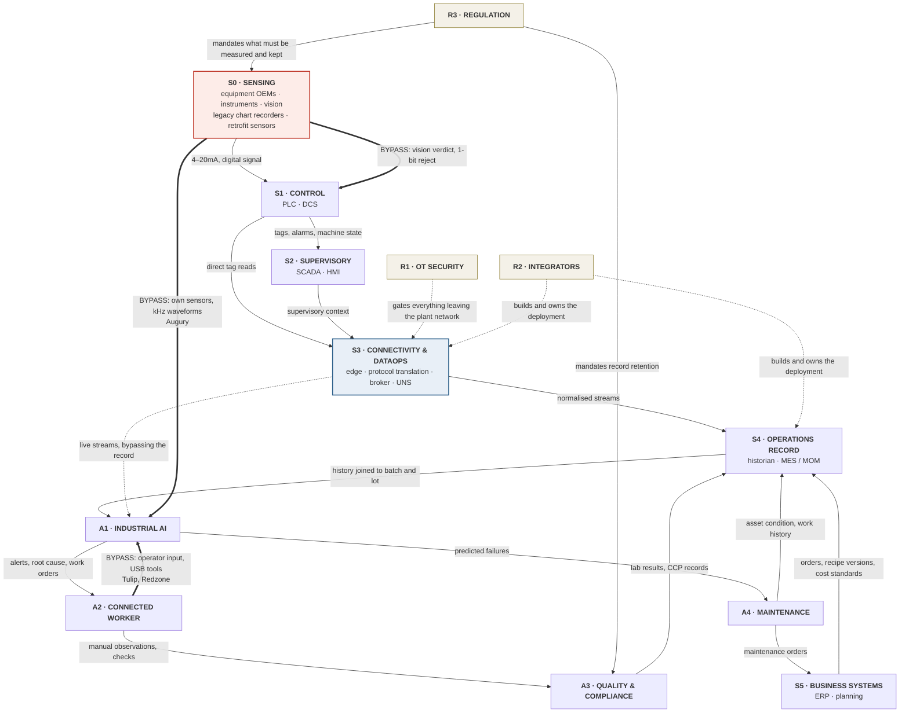

# Market map — manufacturing technology stack

**Date:** 2026-09-28 · **Status:** v1 · **Supersedes:** the 6-step linear flow in
`research-2026-09-24-competitor-case-studies.md`, which is retained as the source of the vendor
rosters.

**What this is.** A formal market map of the manufacturing technology landscape: layers defined by
function, every company placed in a layer, and the interactions between layers stated explicitly.
Built to be argued with — each layer has a definition precise enough that a company either belongs
in it or does not.

**Completeness note.** The rosters below are the union of every company named anywhere in this repo
plus the additions from `research-2026-09-28-industrial-automation-market-study.md`. Provenance is
marked per company: **(R)** already in the repo · **(N)** added by the 2026-09-28 study and sourced ·
**(D)** model knowledge, no source consulted — per rule 1 these are `[UNVERIFIED]` and must be
confirmed before use in any deliverable.

---

## 1. The three-axis structure

A single vertical stack cannot describe this market, because roughly half the vendors do not sit in
the stack at all — they attach to it, or they gate it. The map therefore has three axes.

| Axis | What it contains | Organising principle |
|---|---|---|
| **The stack** (S0–S5) | Everything between the physical process and the business system | Proximity to the physical process; time scale from milliseconds to months |
| **Applications** (A1–A5) | Software that consumes or produces plant data without owning a stack layer | The job it does for the plant |
| **Enabling rails** (R1–R3) | Things that gate, build, or determine what is possible | They constrain every layer rather than occupying one |

---

## 2. The stack — formal definitions

### S0 · Physical process & sensing
**Definition.** The process itself and every device that converts a physical quantity into a signal
or a record. **Produces:** a measurement, or nothing. **Time scale:** continuous.
**Why it is its own layer:** whether a measurement exists at all is decided here, and no layer above
can create one that was never taken.

S0 has four distinct vendor populations, and conflating them is the most common error in
market maps of this space.

**S0a — Process equipment OEMs** *(they decide what ships instrumented)*
Groen (R) · Lee Industries (R) · Admix (R) · Silverson (R) · Breddo / Ensight Solutions (R) ·
ROSS SysCon (R) · Acrison (R) · Sterling Systems (R) · Angelus / BW Packaging (R) · Ferrum (R) ·
CFT Group (R)

**S0b — Process instruments**
Emerson Rosemount (R) · Anderson-Negele (R) · WIPOTEC (R) · Weightech (R) · Mitutoyo (R) ·
Endress+Hauser (D) · Yokogawa field instruments (D) · KROHNE (D) · VEGA (D) · ifm (D)

**S0c — Machine vision & inspection**
Cognex (N) · Keyence (N) · Teledyne / DALSA (N) · Basler (N) · Omron (N) · SICK (N) ·
LandingAI (R) · CanNeed SeamSight-C (R) · OneVision SeamMate (R)

**S0d — Legacy recording devices** *(the measurement exists; the record is paper)*
Partlow (R) · Anderson-Negele circular chart recorders (R) · mercury-in-glass reference
thermometers, mandated by 21 CFR 113 (R)

**S0e — Retrofit condition sensing** *(vendors who bring their own S0 because the plant has none)*
Augury (R) · Petasense (D) · KCF Technologies (D) · Erbessd Instruments (D)

---

### S1 · Basic control
**Definition.** Programmable controllers that read S0 signals and drive actuators deterministically.
**Produces:** register values and control action. **Time scale:** milliseconds.

Rockwell Automation — Allen-Bradley ControlLogix, CompactLogix (R) · Siemens — SIMATIC S7-1200,
S7-1500 (R) · Emerson — DeltaV DCS, PACSystems (R) · Schneider Electric — Modicon, Foxboro DCS (R) ·
ABB — System 800xA, Freelance (R) · Beckhoff — TwinCAT PC-based control (R) ·
Mitsubishi Electric — MELSEC (R) · Omron — Sysmac (R) · Yokogawa — Centum VP (R) ·
B&R Industrial Automation — X20 (R) · Honeywell — Experion PKS (R)

---

### S2 · Supervisory control & HMI
**Definition.** Human-facing monitoring and control across multiple machines or a whole line.
**Produces:** live state, alarms, operator setpoint changes. **Time scale:** seconds.

Inductive Automation — Ignition (R) *(the de facto standard in food and beverage)* ·
Siemens — SIMATIC WinCC (R) · Rockwell — FactoryTalk View (R) ·
AVEVA — Wonderware InTouch, System Platform (R) · GE Vernova — iFIX, CIMPLICITY (R) ·
Emerson — DeltaV Live (R) · Copa-Data — zenon (R) · Schneider — EcoStruxure Geo SCADA Expert (R)

---

### S3 · Connectivity, edge & DataOps
**Definition.** Moves data off control systems, translates proprietary protocols into open ones, and
applies naming and schema. **Produces:** normalised, addressable streams. **Time scale:** seconds.
**Note:** the only layer with no Purdue/ISA-95 equivalent — it is a post-2015 insertion.

HiveMQ — Edge, Data Hub, Enterprise Broker (R) · HighByte — Intelligence Hub (R) ·
Litmus Automation — Litmus Edge, 250+ PLC drivers (R) · PTC — Kepware / KEPServerEX (R) ·
Cirrus Link — MQTT Sparkplug B modules (R) · EMQX (R) · Siemens Industrial Edge (R) ·
Rockwell FactoryTalk Edge Gateway (R)

---

### S4 · Operations record — historians & MES/MOM
**Definition.** Durable storage of process history, and the system that knows what was being made,
to which recipe, on which order. **Produces:** time-series history and lot genealogy.
**Time scale:** hours to days.

**Historians:** AVEVA PI System, formerly OSIsoft (R) · AspenTech InfoPlus.21 (R) ·
GE Vernova Proficy Historian (R) · Honeywell PHD (R) · Canary (D)

**MES / MOM:** Rockwell — Plex Systems, FactoryTalk ProductionCentre (R) ·
Siemens — Opcenter Execution, Opcenter APS (R) · Dassault Systèmes — DELMIA Apriso (R) ·
SAP — Digital Manufacturing (DM / ME / MII) (R) · Emerson — Syncade (R) ·
Parsec Automation — TrakSYS (R) · Critical Manufacturing (R) · Sepasoft — Ignition MES modules (R) ·
Pico MES (R)

**Food-specific ERP / MES:** Deacom / ECI (R) · Aptean Food & Beverage (R) · Wherefour (R) ·
Nulogy — the co-packing-specific incumbent (R)

---

### S5 · Business systems
**Definition.** Commercial and planning systems that originate the order, the recipe version, the
cost standard and the schedule. **Produces:** the context everything below is measured against.
**Time scale:** days to months.

SAP (R) · SAP Business One (R) · Oracle (D) · NetSuite (R) · Infor (R) · Plex (R) ·
Microsoft Dynamics (D) · **Supply-chain planning:** o9 (R) · Blue Yonder (R) · RELEX (R) ·
PlanetTogether (R) · Semia (R)

---

## 3. Applications — attached to the stack, not part of it

### A1 · Industrial AI & advanced analytics
**Definition.** Consumes data from one or more stack layers to predict, optimise or explain.
Owns no layer; depends entirely on what the stack delivers.

**Process analytics & digital twin:** Sight Machine (R) · Seeq (R) · Cognite — Data Fusion (R) ·
Oden Technologies (R) · Quartic.ai (R) · TrendMiner (D) · Takt (R)
**Predictive maintenance:** Augury — Machine Health (R) · Siemens Senseye (R) ·
AspenTech Mtell (R) · Falkonry (R) · C3 AI (R)
**Advanced process control:** Rockwell Pavilion8 MPC (R) · AspenTech DMC3 (R) ·
AVEVA Predictive Analytics (R) · Honeywell Forge (R)
**Applied yield AI:** Augury Process Health, formerly Seebo (R)

### A2 · Connected worker & frontline operations
**Definition.** Digitises what the operator does. Frequently a **data source**, not only a consumer —
it captures observations that never reach S4.

Tulip Interfaces (R) · Redzone (R) · Parsable (R) · Augmentir (R) · Dozuki (R) · Evocon (R)

### A3 · Quality, food safety & compliance
**Definition.** Manages the records a regulator or customer demands, and the specifications a
product must meet.

SafetyChain (R) · Allera (R) · FoodReady (R) · Trustwell — FoodLogiQ + Genesis (R) ·
Safefood 360 (R) · TraceGains (R) · Specright (R)
**LIMS:** LabWare (D) · Thermo SampleManager (D) · STARLIMS (D)

### A4 · Maintenance & asset management
**Definition.** Where a maintenance decision is recorded, scheduled and closed out.

MaintainX (R) · Fiix — Rockwell (R) · UpKeep (D) · IBM Maximo (D) · Limble (D)

### A5 · Commercial & marketplace
**Definition.** Matches demand to capacity, or settles money between trading partners. Outside the
data-layer thesis but inside the same buyer's field of view.

Keychain / KeychainOS (R) · PartnerSlate (R) · Paperless Parts (R) · Glimpse (R) · SupplyPike (R)

### A6 · Physical automation & robotics
**Definition.** Replaces the human action rather than instrumenting it. Relevant to D13's Layer B.

Formic — robotics-as-a-service (R) · Chef Robotics (R) · Figure (R) · 1X (R) · Tesla Optimus (R)

---

## 4. Enabling rails — they gate every layer

### R1 · OT network security
**Why it is a rail, not a layer.** Any project moving data from S1–S3 outward passes a security
review first. Dragos reports shared IT/OT domains in **nearly half of manufacturing assessments, the
highest of any sector** (N).

Claroty (N) · Dragos (N) · Nozomi Networks (N) · Elisity (N)

### R2 · Systems integrators & channel
**Why it is a rail.** SIs build and own most deployments of S2–S4. They are the reason the
**$50–150k implementation cost** exists, and they are the research plan's first interview target.

CSIA member firms (R) · Grantek (D) · Polytron (D) · Malisko (D) · Maverick / Rockwell (D)

### R3 · Regulation
**Why it is a rail.** It is the only force that makes a measurement mandatory, and therefore the
only desk-observable predictor that data exists at all.

FDA 21 CFR 113 — canned low-acid food (R) · 21 CFR 114 — acidified foods (R) ·
Grade A PMO — dairy (R) · USDA FSIS 9 CFR 417 — meat and poultry (R) ·
FSMA 21 CFR 117 preventive controls (R) · FDA Food Traceability Rule, FSMA 204 (R) ·
GFSI schemes — SQF, BRC (R)

---

## 5. The web — how the layers interact

Edges are labelled with **what flows**, not merely that a connection exists.

**Reading the web.** Three features matter and none of them are visible on a linear chart:

1. **S5 feeds S4 downward.** Batch context originates in the business system, not on the floor. Any
   contextualization product depends on a layer most factory-floor maps omit entirely.
2. **The heavy bypass edges (`==>`) skip the middle.** Augury enters at S0 and goes straight to A1;
   connected-worker tools enter at A2 and never touch the control stack; vision decides at S0 and
   returns a single bit to S1. These are the routes that have worked commercially in mid-market.
3. **The rails are dotted because they permit rather than transmit.** R1 does not carry data — it
   decides whether data may leave. R2 does not own a layer — it owns the labour that makes S3 and S4
   work, which is the cost that prices mid-market out.

---

## 6. Where the thesis sits

**D2 claims acquisition and contextualization** — on this map, **S3 and the S3→S4 join**.

| Sub-layer | State of competition | Evidence |
|---|---|---|
| Acquisition — getting bits off the machine | **Commoditised.** Litmus ships 250+ drivers; Kepware is the universal translator | `mdl-arena.md` |
| Naming and schema | **Tooled but manual.** HighByte and HiveMQ provide the modelling; a human maps every tag | `mdl-arena.md` |
| **Joining telemetry to batch and lot** | **Open at mid-market price points.** Sight Machine does it at $150–500k+; nothing found below that | `mdl-arena.md` §Synthesis |

The gap is one cell: **the S3→S4 join, at a price a $10–100M plant can pay.** Everything else in S3
has an incumbent.

---

## Review flags (rule 7)

1. **Companies marked (D) are `[UNVERIFIED]`** — model knowledge, no source consulted this session.
   That is 20 of roughly 150 names: Endress+Hauser, KROHNE, VEGA, ifm, Yokogawa field instruments,
   Canary, Oracle, Microsoft Dynamics, TrendMiner, LabWare, SampleManager, STARLIMS, UpKeep, Maximo,
   Limble, Petasense, KCF, Erbessd, Grantek, Polytron, Malisko, Maverick. Verify before any of them
   appears in a deliverable.
2. **Layer boundaries are a model, and some companies straddle them.** Tulip is A2 but has S4
   characteristics; Plex is both S4 and S5; Ignition via Sepasoft becomes S4. Placement records the
   primary business, not the only one.
3. **The bypass edges are inferred** from vendor architecture descriptions, not from purchase data.
   Carried from the 2026-09-28 study where the hypothesis and its kill condition are stated.
4. **No market sizes appear on this map by choice.** Category sizing in this space disagrees by up to
   4× between report mills; putting numbers on layers would give the map false authority.
5. **Rosters are complete as to this repo, not as to the market.** They are the union of everything
   named in the repo plus this study. Whole categories certainly exist that neither has touched —
   process simulation, energy management, and industrial data marketplaces among them.
