# Competitor & Case Study Deep-Dive: Manufacturing Automation, Industrial AI & Data Platforms

**Date:** 2026-09-27  
**Author:** Aman Mishra / Research Stream  
**Scope:** Industry-agnostic analysis of public competitor offerings, case studies, technical architectures, and harvested problem statements across all 6 layers of modern manufacturing.

---

## Executive Summary: The 6-Step End-to-End Industrial Flow

Every factory technology operates along a clear, 6-step logical pipeline—from physical machine motion up to cloud intelligence and frontline worker execution:

```mermaid
flowchart TD
    classDef step fill:#0f172a,stroke:#38bdf8,stroke-width:2px,color:#f8fafc;

    S1["<b>STEP 1: MACHINE COMPUTERS & REAL-TIME CONTROL (PLC, DCS, IPC)</b><br/><b>What It Does:</b> Rugged physical computers wired to machines. They read electrical sensors (temperature, pressure) and drive motors and valves in milliseconds.<br/><b>Exhaustive Company & Product List:</b><br/>• <b>Rockwell Automation:</b> Allen-Bradley ControlLogix & CompactLogix<br/>• <b>Siemens:</b> SIMATIC S7-1200 & S7-1500<br/>• <b>Emerson Electric:</b> DeltaV DCS & PACSystems<br/>• <b>Beckhoff Automation:</b> TwinCAT PC-based Control<br/>• <b>Schneider Electric:</b> Modicon PLCs & Foxboro DCS<br/>• <b>ABB:</b> System 800xA & Freelance DCS<br/>• <b>Mitsubishi Electric:</b> MELSEC PLCs<br/>• <b>Omron:</b> Sysmac Automation Platform<br/>• <b>Yokogawa:</b> Centum VP DCS<br/>• <b>B&R Industrial Automation:</b> X20 Control System"]:::step

    S2["<b>STEP 2: OPERATOR TOUCHSCREENS & SUPERVISORY CONTROL (SCADA & HMI)</b><br/><b>What It Does:</b> The visual screens on the plant floor. Converts raw electrical signals into live line graphics, flashing alarms, and start/stop controls.<br/><b>Exhaustive Company & Product List:</b><br/>• <b>Inductive Automation:</b> Ignition <i>(Dominant vendor-neutral platform)</i><br/>• <b>Siemens:</b> SIMATIC WinCC<br/>• <b>Rockwell Automation:</b> FactoryTalk View<br/>• <b>AVEVA:</b> Wonderware InTouch & System Platform<br/>• <b>GE Vernova:</b> iFIX & CIMPLICITY<br/>• <b>Emerson Electric:</b> DeltaV Live<br/>• <b>Copa-Data:</b> zenon Software Platform<br/>• <b>Schneider Electric:</b> EcoStruxure Geo SCADA Expert"]:::step

    S3["<b>STEP 3: DATA TRANSLATION, EDGE & MESSAGE HIGHWAY (DATAOPS & UNS)</b><br/><b>What It Does:</b> The data translator and routing highway. Takes cryptic machine codes (like 'N7:0') and renames them to plain-English labels (like 'Mixer_3_Temp') so software can read them over MQTT.<br/><b>Exhaustive Company & Product List:</b><br/>• <b>HiveMQ:</b> HiveMQ Edge Gateway, Data Hub, & Enterprise MQTT Broker<br/>• <b>HighByte:</b> HighByte Intelligence Hub <i>(Industrial DataOps)</i><br/>• <b>Litmus Automation:</b> Litmus Edge <i>(250+ pre-built PLC drivers)</i><br/>• <b>PTC:</b> Kepware / KEPServerEX <i>(Universal protocol translator)</i><br/>• <b>Cirrus Link Solutions:</b> MQTT Sparkplug B Modules<br/>• <b>EMQX:</b> EMQ Enterprise Industrial MQTT Broker<br/>• <b>Siemens:</b> Siemens Industrial Edge<br/>• <b>Rockwell Automation:</b> FactoryTalk Edge Gateway"]:::step

    S4["<b>STEP 4: PLANT RECORDS, HISTORY & WORK ORDERS (HISTORIANS & MES)</b><br/><b>What It Does:</b> The plant's filing cabinet. Saves sensor readings for 10+ years (Historian) and tracks customer orders, recipes, lot genealogy, and batch release (MES).<br/><b>Exhaustive Company & Product List:</b><br/>• <b>AVEVA:</b> AVEVA PI System <i>(Global standard enterprise historian)</i><br/>• <b>Rockwell Automation:</b> Plex Systems Cloud MES & FactoryTalk ProductionCentre<br/>• <b>Siemens:</b> Siemens Opcenter Execution <i>(MES/MOM)</i><br/>• <b>AspenTech:</b> Aspen InfoPlus.21 (IP.21) Process Historian<br/>• <b>Dassault Systèmes:</b> DELMIA Apriso MES<br/>• <b>SAP:</b> SAP Digital Manufacturing (DM / ME / MII)<br/>• <b>Emerson Electric:</b> Syncade MES<br/>• <b>Parsec Automation:</b> TrakSYS MES<br/>• <b>GE Vernova:</b> Proficy Historian & Proficy Plant Applications<br/>• <b>Critical Manufacturing:</b> Critical Manufacturing MES"]:::step

    S5["<b>STEP 5: PREDICTIVE BRAIN & PROCESS OPTIMIZATION (INDUSTRIAL AI & PDM)</b><br/><b>What It Does:</b> The analytics software. Analyzes sensor trends and quality records to predict machine breakdowns before they happen and pinpoint why products came out defective.<br/><b>Exhaustive Company & Product List:</b><br/>• <b>Sight Machine:</b> Manufacturing Data Platform & Streaming Digital Twin<br/>• <b>Augury:</b> Machine Health <i>(Vibration/PdM)</i> & Process Health <i>(Seebo Yield AI)</i><br/>• <b>Seeq:</b> Seeq Workbench & Vantage <i>(Time-series analytics)</i><br/>• <b>Cognite:</b> Cognite Data Fusion (CDF) <i>(Industrial DataOps & 3D Twins)</i><br/>• <b>Oden Technologies:</b> Oden Process AI <i>(Continuous extrusion & plastics)</i><br/>• <b>Quartic.ai:</b> Quartic Platform <i>(Batch & Life Sciences Autonomous AI)</i><br/>• <b>Siemens:</b> Senseye Predictive Maintenance<br/>• <b>Rockwell Automation:</b> Pavilion8 Model Predictive Control (MPC)<br/>• <b>AspenTech:</b> Aspen Mtell <i>(PdM)</i> & Aspen DMC3 <i>(APC)</i><br/>• <b>C3 AI:</b> C3 AI Reliability & Production Schedule Optimization<br/>• <b>Falkonry:</b> Falkonry Time-Series AI <i>(Automated anomaly detection)</i>"]:::step

    S6["<b>STEP 6: WORKER TABLET APPS & HUMAN EXECUTION (CONNECTED WORKER)</b><br/><b>What It Does:</b> Replaces paper binders with iPads at the line. Shows operators step-by-step visual SOPs, checks tool torque/scales, and logs shift handovers.<br/><b>Exhaustive Company & Product List:</b><br/>• <b>Tulip Interfaces:</b> Frontline Operations App Platform <i>(No-code line apps)</i><br/>• <b>Redzone:</b> Connected Workforce Solution <i>(OEE, coaching & daily huddles)</i><br/>• <b>Parsable:</b> Connected Worker Platform <i>(Enterprise mobile SOPs)</i><br/>• <b>Augmentir:</b> AI-Powered Connected Worker Platform<br/>• <b>Dozuki:</b> Digital Standard Work Instructions & Training Platform"]:::step

    %% Sequential Data & Control Flow
    S1 -->|"1. Raw electrical sensor signals (4-20mA) & motor states"| S2
    S2 -->|"2. Live line status, operator setpoint changes & alarms"| S3
    S3 -->|"3. Clean, normalized data streams over MQTT (e.g., Plant/Line/Mixer/RPM)"| S4
    S4 -->|"4. Sensor history matched with Batch IDs, Recipes & Work Orders"| S5
    S5 -->|"5. Actionable alerts, root-cause findings & maintenance work orders"| S6
```

---

## Architectural Context: IT, OT, and ET

Understanding modern industrial data requires distinguishing the three technical domains of a factory:

* **OT (Operational Technology):** The physical shop floor (PLCs, SCADA, DCS, drives). Focus: determinism, sub-second latency, zero downtime, worker safety.
* **IT (Information Technology):** The business and transactional layer (ERP, WMS, CRM). Focus: financial reconciliation, order dispatch, governance, data integrity.
* **ET (Engineering Technology):** The physical design and specifications (CAD, P&IDs, laser scans, PLM). Focus: design tolerances, asset schematics, physics models.

**The Convergence Moat:** Advanced platforms (Cognite, Sight Machine) generate value by unifying all three:
1. *OT telemetry:* "Pump P-102 vibration spiked to 12.8 mm/s."
2. *ET design context:* "Pump P-102 nominal tolerance is 4.5 mm/s; here is its P&ID schematic in Area 3."
3. *IT business impact:* "Pump P-102 is currently running Batch #8491 ($60k customer order); replacement bearings are in Stockroom B."

---

## Part 1: Company Directory & Technical Profiles

### 1. The Industrial Automation & DCS/SCADA Incumbents

#### **Emerson Electric**
* **Primary Products:** DeltaV (Distributed Control System / DCS), Ovation, Plantweb Digital Ecosystem, AMS Device Manager, Plantweb Insight, AspenTech suite (majority acquisition).
* **What They Do:** Dominates continuous process and hybrid industries (refining, chemical, life sciences, power, F&B). Deep hardware-software coupling connecting smart field instrumentation (HART, WirelessHART, Foundation Fieldbus) into DeltaV controllers.
* **Key Public Case Studies & Quantified Results:**
  * *Braskem (Petrochemicals):* AMS Device Manager identified a single leaking control valve, saving $297,500/year and preventing an emergency shutdown (> $6M avoided loss) ([Source](https://www.emerson.com/)).
  * *ExxonMobil (Refining):* WirelessHART temperature sensor arrays for catalyst regeneration deployed 6 weeks faster with 49% lower installation costs ([Source](https://www.emerson.com/)).
  * *Cedarburg Pharmaceuticals:* DeltaV "Built for Batch" architecture delivered strict cGMP batch reproducibility across multi-client suites ([Source](https://www.emerson.com/)).
  * *Energy & Compressed Air Manager:* 5% to 15% site energy reduction via acoustic/mass-flow leak detection ([Source](https://www.emerson.com/)).

#### **Rockwell Automation**
* **Primary Products:** Allen-Bradley ControlLogix/CompactLogix, FactoryTalk View (SCADA), Plex Systems (Cloud MES/ERP), Pavilion8 (MPC), Fiix (CMMS).
* **What They Do:** Dominant North American vendor in discrete manufacturing, packaging, and hybrid process lines. EtherNet/IP and CIP protocol extraction; acquired Plex Systems for cloud MES and Fiix for CMMS.
* **Key Public Case Studies & Quantified Results:**
  * *Fluorsid S.p.A. (Chemicals):* Pavilion8 multivariable MPC cut waste by 50%+ and reduced CO2 emissions ([Source](https://www.rockwellautomation.com/)).
  * *Ethanol Producer:* Pavilion8 increased dryer throughput by 14.5 metric tons/hour (3x project target) ([Source](https://www.rockwellautomation.com/)).
  * *Thai Summit (Automotive Stamping):* Plex MES drove a 50% revenue capacity expansion without adding footprint ([Source](https://www.rockwellautomation.com/)).
  * *Ultra Tool & Manufacturing:* Plex ERP/MES saved $100,000+ and 243 manual labor hours annually ([Source](https://www.rockwellautomation.com/)).

#### **Siemens Digital Industries**
* **Primary Products:** SIMATIC S7-1200/S7-1500, TIA Portal, SIMATIC WinCC (SCADA), Siemens Opcenter (MES/MOM & APS), Senseye Predictive Maintenance, Siemens Industrial Edge.
* **What They Do:** European automation powerhouse spanning hardware controllers (S7 PLCs), supervisory SCADA (WinCC), execution (Opcenter), and AI predictive maintenance (Senseye).
* **Key Public Case Studies & Quantified Results:**
  * *BASF (Agrochemicals):* Opcenter Execution cut batch production time by 5%–10% and eliminated 5 days of manual paperwork per month ([Source](https://www.siemens.com/)).
  * *Terumo Americas (MedTech):* Replaced paper DHRs with Opcenter, slashing material release review times from days to minutes ([Source](https://www.siemens.com/)).
  * *Trek Bicycle (Assembly):* Opcenter APS doubled scheduling output with the same team size, eliminating starved line shutdowns ([Source](https://www.siemens.com/)).
  * *BlueScope Steel:* Senseye detected subsurface bearing and hydraulic line degradation weeks in advance ([Source](https://www.siemens.com/)).

#### **Schneider Electric & AVEVA**
* **Primary Products:** AVEVA PI System (OSIsoft), AVEVA System Platform (Wonderware), AVEVA Predictive Analytics, Modicon PLCs, Foxboro DCS.
* **What They Do:** Benchmark for enterprise operational time-series data infrastructure (historians) and plant electrification.
* **Key Public Case Studies & Quantified Results:**
  * *PETRONAS (Oil & Gas):* AVEVA Predictive Analytics achieved a 14x ROI and saved $17.4 million across rotating equipment ([Source](https://www.aveva.com/)).
  * *Klabin (Pulp & Paper):* Real-time PI digital twins delivered ~$10M in maintenance savings and boosted net production by 3,400 tons ([Source](https://www.aveva.com/)).
  * *Kellogg's:* Standardized automated SPC on packaging lines to cut overfill giveaway ([Source](https://www.aveva.com/)).
  * *Pampa Energia:* Anomaly algorithms prevented a $7M gas turbine repair ([Source](https://www.aveva.com/)).

---

### 2. Industrial DataOps, Edge & UNS Infrastructure (The Plumbing Layer)

#### **HiveMQ**
* **Primary Products:** HiveMQ Enterprise MQTT Broker, HiveMQ Edge (Open-Source Industrial Edge Gateway), HiveMQ Data Hub.
* **What They Do:**
  * Sits at the center of the **Unified Namespace (UNS)** architecture.
  * **HiveMQ Edge:** Deployed on edge IPCs to connect directly to industrial field devices (Modbus, Siemens S7, OPC UA, BACnet) and translate them into MQTT Sparkplug B.
  * **HiveMQ Data Hub:** Broker-level policy and data transformation engine that validates and normalizes payloads against JSON/Sparkplug schemas before routing to enterprise systems or cloud data lakes.
* **Comparison Against Mid-Market Startup Thesis:**
  * *Strengths:* World-class scalable MQTT broker, open protocol edge adapters.
  * *The Seam:* Developer-first infrastructure deployed via Docker/Kubernetes. Does *not* auto-contextualize batch records or recipes out of the box; requires internal OT/IT software engineers or expensive system integrators.

#### **HighByte**
* **Primary Products:** HighByte Intelligence Hub.
* **What They Do:** Industrial DataOps software hub. Ingests raw tags via OPC UA, MQTT, and SQL, normalizes engineering units, and maps them into standardized ISA-95 hierarchical data models before publishing to cloud/MQTT.
* **Role in Arena:** The pure-play pioneer of DataOps. Provides the modeling tools, but requires human engineers to manually define and map every tag schema.

#### **Litmus Automation**
* **Primary Products:** Litmus Edge, Litmus Edge Manager.
* **What They Do:** Edge platform with 250+ native PLC drivers (Rockwell, Siemens, Mitsubishi, Omron, Beckhoff). Ingests raw machine data at the edge, normalizes it locally into JSON, and routes it via MQTT/Kafka.

#### **PTC (Kepware)**
* **Primary Products:** KEPServerEX.
* **What They Do:** The universal industrial connectivity server. Translates hundreds of legacy proprietary PLC protocols into standardized OPC UA and MQTT.

---

### 3. Industrial AI & Advanced Process Analytics

#### **Sight Machine**
* **Primary Products:** Manufacturing Data Platform, Streaming Digital Twin, Operator Agent.
* **What They Do:** Ingests dirty factory data (PLCs, historians, MES, quality lab records, ERP) and builds a streaming digital twin to continuously optimize yield, scrap, and throughput.
* **Key Public Case Studies & Quantified Results:**
  * *Toyota Industries (Nagakusa Plant):* 25% reduction in paint shop seeding defects; compressed root-cause analysis from 5 days to <4 hours; 18% winter CO2 cut ([Source](https://www.sightmachine.com/news)).
  * *Packaging Converter:* 5% savings in production costs per unit via continuous paper roll lot tracking ([Source](https://www.sightmachine.com/)).

#### **Augury**
* **Primary Products:** Machine Health (vibration/ultrasound sensors + AI), Process Health (formerly Seebo, process yield AI).
* **What They Do:** Bypasses machine PLCs using external wireless vibration/ultrasound sensors for predictive maintenance, and ingests SCADA process time-series to eliminate multivariable scrap.
* **Key Public Case Studies & Quantified Results:**
  * *DuPont:* 7x ROI in <12 months detecting pump harmonics ([Source](https://www.augury.com/)).
  * *Barilla & Lindt:* Modeled non-linear ingredient and thermal variables to eliminate product scrap and stabilize conching/tempering ([Source](https://www.augury.com/)).

#### **Seeq**
* **Primary Products:** Seeq Workbench, Seeq Organizer, Seeq Vantage.
* **What They Do:** Self-service point-and-click time-series analytics and ML connecting on top of installed historians (AVEVA PI, AspenTech IP.21).
* **Key Public Case Studies & Quantified Results:**
  * *Sanofi:* Pinpointed root cause of sterility loss in aseptic filling ([Source](https://www.seeq.com/)).
  * *Regeneron:* Reduced commercial bioreactor alarm fatigue from 700/batch to ~40/month ([Source](https://www.seeq.com/)).

#### **Oden Technologies**
* **Primary Products:** Oden Process AI.
* **What They Do:** Applied process AI for continuous plastics, extrusion, and wire & cable.
* **Key Public Case Studies & Quantified Results:**
  * *Lake Cable:* Anomaly troubleshooting cut from 5 days to 20 minutes; 25% first-pass yield boost ([Source](https://www.oden.io/)).
  * *INX International:* 40%+ line run rate increase and 20%+ OEE lift ([Source](https://www.oden.io/)).

---

### 4. Frontline Operations & Connected Worker Platforms

#### **Tulip Interfaces**
* **Primary Products:** Frontline Operations Platform (No-Code App Platform).
* **What They Do:** Replaces paper binders with interactive tablet apps for digital SOPs, line clearance, and direct tool integration (digital calipers, scales).
* **Key Results:** VEKA achieved an 88% reduction in quality escapes; Mack Molding cut QA inspection time by 50% ([Source](https://www.tulip.co/)).

#### **Redzone**
* **Primary Products:** Connected Workforce Solution.
* **What They Do:** iPad-centric social workflow software focused on frontline operator engagement, daily huddles, and rapid 90-day OEE lifts without complex PLC integration.
* **Key Results:** 12% to 14% OEE improvement and 74% reduction in employee turnover within 90 days ([Source](https://rzsoftware.com/)).

---

## Part 2: Industry-Agnostic Problem Statements Harvest

### Problem 1: Catastrophic Mechanical Failure on Critical Rotating Assets
* **Sufferer:** Plant Reliability Engineer & Maintenance Technician.
* **Task That Fails:** Detecting bearing race fatigue, pump cavitation, or motor unbalance before mechanical seizure.
* **Quantified Cost:** $50,000–$500,000+ per event in lost throughput and rush repairs (up to $7M for gas turbines).
* **Mechanism:** Wireless tri-axial vibration/ultrasound sensors bypass the PLC; Fast Fourier Transform (FFT) classifies harmonic defect signatures.
* **Proof Points:** DuPont (7x ROI with Augury), PETRONAS ($17.4M saved with AVEVA), GSK (35 days' warning with Aspen Mtell).

### Problem 2: Multi-Variable Process Drift Causing Off-Spec Scrap & Yield Loss
* **Sufferer:** Process Engineer, Quality Manager, Shift Supervisor.
* **Task That Fails:** Determining why product is defective when all individual machine parameters are within green nominal limits on SCADA.
* **Quantified Cost:** 3% to 12% scrap/rework rates; $100k+ in wasted raw materials.
* **Mechanism:** Joins high-frequency PLC time-series with batch lot IDs and delayed lab test results; multivariate machine learning isolates non-linear parameter interactions.
* **Proof Points:** Toyota Industries (25% defect reduction with Sight Machine), Lake Cable (25% yield boost with Oden), Barilla (scrap cut with Augury).

### Problem 3: Operating in the "Safety Buffer" (Sub-Optimal Throughput & High Energy Consumption)
* **Sufferer:** Operations Manager & Lead Automation Engineer.
* **Task That Fails:** Pushing continuous kilns, dryers, and reactors to theoretical design capacity without triggering trips.
* **Quantified Cost:** Plants run 5% to 15% below capacity; hundreds of thousands in excess fuel/power.
* **Mechanism:** Model Predictive Control (MPC) and virtual online analyzers solve quadratic optimization equations every 10–30 seconds to operate right against constraint boundaries.
* **Proof Points:** Ethanol Producer (+14.5 t/h throughput with Rockwell Pavilion8), Fluorsid (50% waste cut).

### Problem 4: "Golden Batch" Drift and Extended Batch Cycle Times
* **Sufferer:** Batch Process Engineer, Lead Biochemist.
* **Task That Fails:** Replicating the exact optimal multi-phase profile of the historical golden batch.
* **Quantified Cost:** 10%–25% extended cycle times; $50k–$1M+ per lost batch in pharma/chemicals.
* **Mechanism:** Dynamic Time Warping (DTW) aligns time-series against ISA-88 batch phases; Multivariate Statistical Process Control (MSPC) tracks confidence ellipses.
* **Proof Points:** Sanofi (sterility loss root-cause with Seeq), Biopharma Fermentation (+15% capacity with Quartic.ai).

### Problem 5: Frontline Paperwork Burden, Quality Escapes & Release Delays
* **Sufferer:** Line Operator, Quality Release Specialist.
* **Task That Fails:** Recording manual line clearance checks, net-weight logs, torque values, and auditing paper binders.
* **Quantified Cost:** 3 to 7 days product warehouse hold waiting for QA sign-off; downstream warranty recalls.
* **Mechanism:** No-code tablet apps with direct Bluetooth/USB tool integration enforce execution; automated review-by-exception releases batches in minutes.
* **Proof Points:** Terumo Americas (release times cut from days to minutes via Siemens Opcenter), VEKA (88% escape cut with Tulip).

### Problem 6: Control Room Alarm Fatigue & Operator Cognitive Overload
* **Sufferer:** Console Operator & Plant Safety Engineer.
* **Task That Fails:** Triaging 500+ cascade alarms during an upset without missing critical safety indicators.
* **Quantified Cost:** Catastrophic trips, operator turnover, ISA-18.2 compliance violations.
* **Mechanism:** State-based dynamic suppression mutes secondary consequential alarms based on machine state.
* **Proof Points:** Regeneron (cut alarms from 700/batch to 40/month via Seeq).

### Problem 7: Silent Utility Waste (Compressed Air, Steam, Fuel, Water)
* **Sufferer:** Energy/Sustainability Manager & Facilities Director.
* **Task That Fails:** Detecting compressed air leaks and blow-through steam traps across sprawling piping networks.
* **Quantified Cost:** 15% to 30% of utility energy wasted; $50,000–$250,000/year per plant.
* **Mechanism:** Pervasive non-invasive acoustic sensors continuously calculate dollar loss per hour from ultrasonic leak profiles.
* **Proof Points:** Emerson Energy & Compressed Air Manager (5%–15% site energy cut), Toyota Industries (18% winter CO2 cut).
