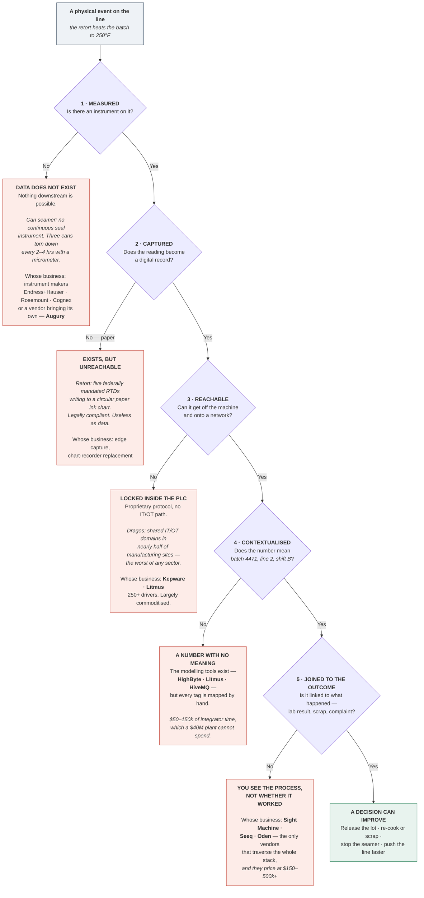

# Industrial automation market study — is the 6-step chart right?

**Date:** 2026-09-28 · **Board lines served:** Q1 (*study manu-AI companies on what they are doing*), Q2 (*what data is required*), and the arena disqualifier from D8.

**What this is.** A critical review of the 6-step end-to-end industrial flow in
`research-2026-09-24-competitor-case-studies.md`, benchmarked against the model the industry
actually uses, plus a synthesis of the ~36 quantified case studies collected across that file and
`mdl-arena.md`. Written to answer two questions: is the chart defensible if a professor pushes on
it, and what do the case studies actually establish.

---

## Verdict in one paragraph

**The chart is good as a teaching device and wrong as a model.** Its six categories are real, the
vendor assignments are accurate, and the plain-English gloss under each step is better than the
industry's own vocabulary. But it is drawn as a **linear pipeline**, and the industrial stack is not
a pipeline — it is a hierarchy that the most interesting companies deliberately **bypass**. It also
starts one level too high and stops one level too low, which matters more for this thesis than for
most, because the missing bottom level is exactly where "does the data exist" is decided. Three
structural fixes and five additions below.

---

## 1. Benchmark: what the industry's own model says

The canonical reference is the **Purdue Enterprise Reference Architecture**, carried into the
**ISA-95** standard (ANSI/ISA-95, *Enterprise-Control System Integration*). It defines five levels,
each operating on a different time scale — milliseconds at the bottom, months at the top
([ISA](https://www.isa.org/standards-and-publications/isa-standards/isa-95-standard),
[Inductive Automation on Purdue](https://inductiveautomation.com/resources/article/the-purdue-model-and-ignition),
[MaintainX ISA-95 primer](https://www.getmaintainx.com/learning-center/what-is-isa-95)).

| Purdue / ISA-95 | What it is | Our chart |
|---|---|---|
| **Level 0** — physical process | The process itself, and the sensors and actuators that turn it into signal | **MISSING** |
| **Level 1** — basic control | PLC, DCS: reads sensors, drives valves and motors in milliseconds | Step 1 ✓ |
| **Level 2** — supervisory control | SCADA, HMI: the screens, alarms, setpoints | Step 2 ✓ |
| *(no Purdue level)* | Data translation, edge, message broker, unified namespace | Step 3 — a modern insertion, correctly identified |
| **Level 3** — manufacturing operations | MES/MOM, historian: orders, recipes, lot genealogy, batch release | Step 4 ✓ |
| **Level 4** — business planning | ERP: customer orders, cost, planning | **MISSING** |
| *(cuts across)* | Analytics and AI | Step 5 |
| *(cuts across)* | Connected worker | Step 6 |

**Read:** steps 1, 2 and 4 map cleanly onto Purdue levels 1, 2 and 3. Step 3 is a genuine addition
the 1990s model does not have, and identifying it as its own layer is the chart's best judgment
call. Steps 5 and 6 are not levels at all — they are consumers that attach at several levels, which
is why the linear arrows into them misfire.

---

## 2. Three structural problems

### P1 — Level 0 is missing, and for this thesis that is the important one

The chart begins at the PLC. But the PLC can only report what an instrument measures, and whether
that instrument exists is a **Level 0** question. For a thesis whose first asterisk is *does data
exist*, starting at Level 1 quietly assumes the answer.

Our own process-flow work already shows why this matters. In retort canning
(`mdl-process-flows.md`), the seamer — where a defect causes a botulism recall — has **no continuous
seal-quality instrument at all**. Seam integrity is checked by destructively tearing down three cans
every 2–4 hours with a micrometer. No amount of PLC connectivity surfaces a measurement that is
never taken. That is a Level 0 absence, and it is invisible on a chart that starts at Level 1.

The same file records the opposite case in the same plant: the retort itself carries 3–5 Class-A
RTDs, a pressure transducer and a vent thermometer, because 21 CFR 113 requires them. Level 0 is
where the answer varies, and the chart cannot show that.

### P2 — Level 4 (ERP) is missing, which breaks the contextualization story

`mdl-arena.md` names the central prize as joining **Primitive 1 (slow process telemetry)** to
**Primitive 4 (batch and lot metadata)**. But batch metadata largely originates *above* Step 4, in
the ERP or order system — the work order, the customer, the recipe version, the cost standard.
Cognite's whole pitch is unifying OT, IT and ET, and the IT half is Level 4. A chart that stops at
MES cannot show where half of the context actually comes from.

### P3 — The arrows are wrong: the stack is bypassed more often than it is traversed

The chart draws S1→S2→S3→S4→S5→S6 as a sequence. The defining pattern of the last decade of
successful entrants is the opposite — **they route around the middle**:

| Player | What it bypasses | Why | Source |
|---|---|---|---|
| **Augury** | Steps 1, 2 and 3 entirely | Legacy PLCs do not sample at the kHz rates vibration analysis needs, so it ships its own wireless sensors and cellular gateway — its own Level 0 | `mdl-arena.md` |
| **LandingAI / vision** | Steps 3 and 4 | Camera → edge PC → a 1–2 bit handshake with the PLC. Needs zero historical telemetry | `mdl-arena.md` |
| **Redzone** | Step 1 onward | Deliberately avoids PLC integration; a photo-eye on the discharge and operator taps on iPads. Its mid-market adoption is *because* of this, not despite it | `mdl-arena.md` |
| **Tulip** | Steps 1–4 | USB scales, calipers, scanners and operator input — a parallel data path that never touches the control system | `mdl-arena.md` |
| **Seeq** | Steps 1–3 | Reads the historian; assumes everything below is already solved | `mdl-arena.md` |

This is the single most important correction, because it bears directly on **D2** (we are claiming
layers 1 and 2 — acquisition and contextualization). If the commercially successful pattern in
mid-market is to *avoid* the PLC stack rather than integrate it, then building at Step 3 is building
into the path that entrants keep routing around. That is not fatal — Sight Machine and Oden do go
through the stack and get paid — but it is a live objection the thesis has not yet answered.

`Hypothesis:` bypass wins in mid-market because integration cost, not capability, is the binding
constraint. **What would kill it:** finding mid-market plants ($10–100M) that bought a
through-the-stack product (Oden, Sight Machine, Litmus) at a price they could afford. **What would
confirm it:** the reverse — that every mid-market reference is a bypass product.

---

## 3. Five things the chart leaves out

| Missing | Why it matters | Who |
|---|---|---|
| **Machine vision as a category** | Vision is one of the four data primitives, and the market leaders are absent entirely. The top five hold only 20–30% of a fragmented ~$15.8B (2025) market | Cognex, Keyence, Teledyne, Basler, Omron ([MarketsandMarkets](https://www.marketsandmarkets.com/Market-Reports/industrial-machine-vision-market-234246734.html)) |
| **Maintenance systems (CMMS/EAM)** | Where a maintenance decision is actually recorded and acted on. Rockwell bought Fiix; MaintainX has 11k+ customers including F&B | MaintainX, Fiix, UpKeep, IBM Maximo |
| **OT network security** | The gatekeeper for any plant-to-cloud project. Dragos reports shared IT/OT domains in **nearly half of manufacturing assessments — the highest of any sector** ([Dragos](https://www.dragos.com/blog/manufacturing-cybersecurity-ot-threats)). Getting data out is a security review before it is an engineering task | Claroty, Dragos, Nozomi |
| **Quality and lab systems (LIMS)** | The off-line lab result is one half of every yield correlation Sight Machine sells. It lives in a separate system | LabWare, STARLIMS, SampleManager |
| **Systems integrators** | Not a product layer but the **channel** — they build and own these deployments, and they are the reason the $50–150k implementation cost exists. Also the research plan's #1 interview target | CSIA member firms, Grantek, Polytron, Malisko |

---

## 4. Synthesis of the case studies

**36 quantified claims across the corpus.** Read as a body rather than one by one, five things stand
out, and the fifth is the one that matters for Prof. Ferreira's challenge.

### 4.1 The sample is entirely enterprise — including all of the food ones

| Industry | Cases | Named |
|---|---|---|
| Oil, gas, petrochemical | 7 | Braskem, ExxonMobil, PETRONAS, Pampa, Syncrude, Lundin, one unnamed hydrocarbon |
| Pharma / biotech | 6 | Cedarburg, Sanofi, Regeneron, GSK, Terumo, one unnamed biopharma |
| Automotive / discrete | 6 | Toyota Industries, Thai Summit, Trek, VEKA, Mack Molding, Ultra Tool |
| **Food & beverage** | **5** | **Kellogg's, PepsiCo/Frito-Lay, Barilla, Lindt, one unnamed CPG** |
| Chemicals | 3 | Fluorsid, Covestro, INX |
| Pulp, paper, packaging | 2 | Klabin, one unnamed converter |
| Steel, cable, ethanol | 3 | BlueScope, Lake Cable, one ethanol producer |

**Every food case is a multi-billion-dollar manufacturer.** Kellogg's, PepsiCo, Barilla and Lindt are
10–100× the size of the $10–100M plants this thesis targets. **Not one case study in the entire
corpus comes from a plant in the target segment.** That is the central limitation of the desk
evidence and it should be stated on the deck in those words.

### 4.2 The value splits into five types, and they are not equally transferable

| Value type | Typical claim | Transfers to mid-market F&B? |
|---|---|---|
| Avoided catastrophic failure | $297k–$17.4M; 7–14× ROI | **Weakly.** The headline numbers come from asset-heavy continuous plants — turbines, compressors, refineries. A $40M food plant has no $7M turbine |
| Yield and scrap | 25–50% reduction | **Plausibly.** Closest to food economics, and Barilla and Lindt are the two food examples here |
| Throughput | +14.5 t/h; +40% run rate; +15% capacity | **Conditionally.** Only pays where the plant is capacity-constrained and can sell the extra output |
| Labour and paperwork | 5 days/month; days→minutes; 243 hrs/yr | **Strongly.** Scales with headcount and regulation, both of which mid-market has |
| Energy and utilities | 5–18% | **Plausibly**, and it is the least segment-dependent of the five |

### 4.3 The recurring mechanism is time-to-answer, not the answer

This is the pattern nobody in the corpus names explicitly, and it recurs across unrelated vendors
and industries:

- **Lake Cable** (Oden): anomaly troubleshooting **5 days → 20 minutes**
- **Toyota Industries** (Sight Machine): root-cause analysis **5 days → under 4 hours**
- **Terumo** (Siemens Opcenter): material release review **days → minutes**
- **Regeneron** (Seeq): alarms **700 per batch → 40 per month** — triage time, not fewer faults
- **BASF** (Opcenter): **5 days of paperwork eliminated per month**

In each case the plant could already reach the answer. The data did not reveal something
unknowable; it **collapsed the time to reach it**. That reframes the business case: the product is
not usually sold on better decisions, it is sold on *faster* ones — and the cost of slowness is
inventory held, product quarantined, and skilled people spending days on reconstruction.

**This is the most direct answer available to "which decisions?"** The decisions being improved are
mostly *diagnostic* — why did this batch go wrong, can I release this lot, is this machine about to
fail — and the measurable saving is the hold time and the engineer-days, not a better outcome.

### 4.4 Effect sizes cluster suspiciously tightly

Yield and defect improvements land at **25%** three separate times (Toyota defects, Lake Cable
first-pass yield, and Oden's OEE lift at 20%). Energy lands at 5–18% repeatedly. These are vendor
marketing pages, self-reported, with no methodology, no baseline period and no control. Grade **B**
at best under the repo's own scale, and the tight clustering is more consistent with house style
than with measurement.

### 4.5 Not one case study states the counterfactual

Every case gives a **delta** — 25% fewer defects, $17.4M saved. **None states how the decision was
made before, or what that method cost.** Kris's challenge asks for exactly the missing column:

> *"For each business decision impacted, try to figure out how they currently make the decision
> without your proposed data solution, and what impact your solution would have on revenue and/or
> cost."*

The corpus cannot answer the first half. Vendors publish the improvement, never the baseline,
because the baseline is unflattering to the customer who agreed to the case study. This is a
structural property of the evidence, not a gap in our searching, and it is the strongest available
justification for moving to primary calls.

---

## 5. Market sizing — and why the numbers are nearly useless

For MES alone, published 2025 estimates range from **$4.62B to $19.98B** — a 4× spread for the same
category in the same year ([Roots Analysis $4.62B](https://www.rootsanalysis.com/reports/manufacturing-execution-systems-market.html),
[MarketsandMarkets $15.95B](https://www.marketsandmarkets.com/Market-Reports/manufacturing-execution-systems-mes-market-536.html),
[Grand View $17.57B](https://www.grandviewresearch.com/industry-analysis/manufacturing-execution-systems-market-report),
[Global Growth Insights $19.98B](https://www.globalgrowthinsights.com/market-reports/manufacturing-execution-system-mes-market-124187)).
Machine vision is quoted at **$15.83B (2025) → $23.63B (2030), 8.3% CAGR**
([MarketsandMarkets](https://www.marketsandmarkets.com/Market-Reports/industrial-machine-vision-market-234246734.html)).

Per repo rule 2 these are recorded as ranges, and per rule 1 they are graded **C — report mill**.
They are adequate for "this is a multi-billion-dollar category" and inadequate for anything else. A
market study should say so rather than picking the convenient number.

---

## 6. The consolidation the chart does not show

The incumbents have spent the last four years buying the analytics layer. This is arena evidence
under D8 — arena as a **disqualifier**:

- **Emerson → AspenTech.** Completed **12 March 2025**, ~**$7.2B** for the 43% it did not already
  own, at $265/share, following a 55% majority stake in 2022. AspenTech is now wholly owned
  ([Emerson IR](https://ir.emerson.com/news-events/press-releases/detail/11/emerson-completes-acquisition-of-remaining-outstanding-shares-of-aspentech),
  [Emerson 10-K FY2025](https://www.sec.gov/Archives/edgar/data/32604/000003260425000087/emr-20250930.htm)) — **Grade A, SEC filing.**
- **Schneider → AVEVA** (which had already absorbed OSIsoft/PI System and Wonderware).
- **Rockwell → Plex** (cloud MES) and **Fiix** (CMMS).
- **Siemens → Senseye** (predictive maintenance).
- **PTC → Kepware.**

**Read:** steps 4 and 5 of the chart are being absorbed into the step-1 hardware vendors. A startup
at step 3 is selling into a market whose largest buyers are assembling the same capability by
acquisition, and whose incumbents already own the customer relationship and the installed base.
That is a real competitive fact the current chart hides by treating the six steps as independent.

---

## 7. Proposed replacement: the five gates

The existing chart answers *"who sells what."* The thesis needs a chart that answers *"can this
plant's data reach a decision, and where does it stop."* Those are different questions, and the
second is the one Prof. Ferreira is asking.

So the proposal is to replace the six-step vendor pipeline with a **flow that follows one
measurement from the physical event to a business decision, through five gates.** Each gate is a
real failure mode, each has a named example from our own retort work, and each has a set of vendors
whose entire business is that gate. "Does the data exist" stops being one asterisk and becomes five
questions a plant manager can actually answer.

### The bypasses, drawn on the same flow

The reason the old chart misled is that the commercially successful mid-market products **do not
walk this path**. On the gate flow that becomes legible rather than hidden:

| Vendor | Where it enters | What it skips | Why |
|---|---|---|---|
| **Augury** | Solves gate 1 itself — ships its own wireless sensors | Gates 2–5 entirely; its own cloud | Legacy PLCs cannot sample at the kHz rates vibration analysis needs |
| **Redzone** | Gate 1, minimally — one photo-eye plus operator taps | Gates 2–5 | Its mid-market adoption is *because* it avoids PLC work |
| **Tulip** | Skips the machine altogether — asks a human | Gates 1–4 | USB scales and calipers; a parallel path that never touches control |
| **Vision** (Cognex, Keyence) | Gate 1 as a camera, decides at the edge | Gates 3–5 — the verdict is often never logged | Inference happens locally; only a reject signal goes back |
| **Seeq** | Enters at gate 5 | Assumes 1–4 already solved | Reads the installed historian |
| **Sight Machine, Oden** | Walks the whole flow | Nothing | Which is why they cost $150–500k+ |

### Why this chart is the right one for the thesis

1. **It puts the thesis on the map.** D2 claims acquisition and contextualization — that is
   **gates 2, 3 and 4**, and the chart shows gate 3 is commoditised while gate 4 is not. The gap is
   one box, not a vague layer.
2. **It makes the hypothesis testable in a sentence.** *Which gate does your plant stop at?* is a
   question a plant manager can answer in thirty seconds, and no desk source can answer at all.
3. **It separates the two halves of the board's asterisk.** *Data exists* is gate 1; *not in a usable
   format* is gates 2 through 5. Those have been running together.
4. **It carries the competitive fact.** Every gate names who owns it, so the chart is also the arena
   map — and it shows that the further right you go, the more it costs, which is the mid-market
   squeeze in one picture.

---

## Review flags (rule 7)

1. **The bypass claim is an inference, labelled.** It is drawn from five vendors' own architecture
   descriptions in `mdl-arena.md`, not from a survey of what mid-market plants bought. Stated as
   `Hypothesis:` in §2 P3 with its kill condition.
2. **All market-size figures are grade C report-mill numbers** and disagree by up to 4×. Recorded as
   ranges; no point estimate should be quoted from this file.
3. **The 36 case studies are grade B** — vendor and OEM self-reported, no methodology, no baseline,
   no control. §4.4 flags the suspicious clustering.
4. **The "time-to-answer" synthesis in §4.3 is my reading of the corpus**, not a claim any vendor
   makes. It is an inference from five data points across unrelated vendors and could be an artefact
   of which cases get published.
5. **Consolidation list is partly unverified.** Emerson/AspenTech is confirmed to SEC-filing grade.
   Schneider/AVEVA, Rockwell/Plex and Fiix, Siemens/Senseye and PTC/Kepware are carried from the
   existing arena file and vendor sites — dates and values **not** re-verified in this pass, so no
   figures are quoted for them.
6. **No operator has confirmed any of this.** Rule 6 applies in full. The whole point of §4.5 is that
   the desk corpus structurally cannot answer the question that was asked.
